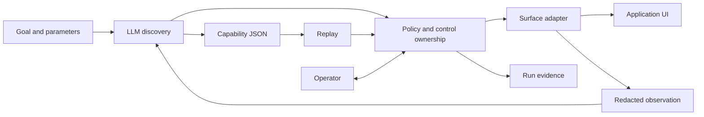

# Architecture

I used a local banking application so the project could exercise failures without accessing a real institution. The workflow searches for a member, reads a savings balance, prepares a sub-account and stops at review. The application has an iframe, table-based forms and unlabeled inputs. It has no business API.

One Node/TypeScript process owns the browser and run state. Playwright handles browser interaction. The supplied DaOS Automation Panel Framework provides the dashboard, while a separate operator page sends manual actions to the same browser session.

The model chooses one action at a time from visible controls. It sees parameter definitions, previous decisions and the names of outputs already collected. The executor supplies values, reads results and verifies checkpoints. Discovery stops on step or time limits, repeated decisions, or an explicit request for help.

The saved discovery used authenticated Codex requests with structured output and ephemeral sessions. An OpenAI Responses adapter is also included, though it was not used for the submitted evidence. Replay does not receive a model provider. A test passes one that throws on any call to catch accidental use.

Keeping sessions in one process made ownership and cancellation easier to test. Logs survive completion, but a process restart loses the browser session. I accepted that limit rather than adding recovery infrastructure before the execution contract was settled.

# Artifact schema

The capability schema is defined in Zod and exported to JSON Schema. It separates the schema version from the capability version. Each artifact includes typed inputs and outputs, a vendor profile digest, target definitions, ordered actions, per-step checkpoints, timeouts, exception handling and a final success condition.

A fill action names an input parameter; a read action names an output. Amounts use decimal strings. The final checkpoint verifies both the review screen and its member/nickname values against the invocation. Reaching another member's review screen cannot count as success.

The artifact contains no input values, model transcript or executable code. Discovery records the controls it used and the screen changes it observed. Model request receipts and observation hashes link it to the source run, but do not approve it for use.

One limit matters here: the vendor profile supplies the vocabulary, locator definitions and savings-review contract. The model discovers the action order within that contract. It does not build a profile for an arbitrary application. Replay checks the artifact against the independently configured profile and policy, so editing a target or success condition cannot grant more access.

# Determinism & error handling

Targets use exact accessible button names and named frame paths. For legacy fields, the adapter finds an exact table label and uses its adjacent value cell. A target must resolve to one visible control. Missing, duplicate or renamed controls stop the run; there is no fuzzy fallback.

The engine checks the screen before and after each action, then checks again immediately before acting. Replay follows these rules:

- A missing member or validation message returns a business outcome and stops further actions.
- A known loading screen gets a bounded wait. A maintenance notice can be dismissed once.
- Session expiry, permission denial, application errors and unexpected dialogs request operator help.
- A missing target or expired wait records a failure and offers the live session for inspection.

A click gets an actionability check before execution. Once attempted, it is not retried automatically. If an unknown error occurs after an action, operator inspection does not turn the run into a success. This avoids claiming certainty about whether an action took effect.

Results include a status, code, outputs, step, expected/observed state and run/session IDs. Tests cover changed parameters, incorrect review identity, invalid outputs and injected application errors. Determinism means fixed actions and declared branches; timestamps and loading duration still vary.

# Heterogeneity & multi-tenant

`Surface` defines observation, actions, verification, snapshots and cleanup separately from the flow interpreter. The implementation uses a browser adapter. A desktop adapter would need to map targets to UI Automation or accessibility ancestry. A visual adapter would also need reference images, anchors, coordinate calibration and confidence checks. Unsupported target strategies are rejected today; adding one requires a schema revision and adapter tests.

For reuse across institutions, I would keep the semantic capability at vendor level and bind each application instance to a reviewed profile version. Overrides could change entry points, frame ancestry, branding and control labels. They could not remove checkpoints or widen permissions.

The current profile digest and exact target matching detect some incompatibilities. They do not establish compatibility with every vendor version. A production registry would track tested versions, run synthetic checks before promotion and retain older bindings for rollback. A failed binding would go for review rather than trigger automatic recording against customer data.

# Escalation & handoff

Ownership is explicit: `automation`, `unclaimed`, `human` or `closed`. Every UI action and ownership change goes through one serialized gate. When automation pauses, it waits for in-flight work, increments the ownership epoch and records an intervention. The operator claims control with an opaque token tied to a new epoch. Competing claims and stale tokens are rejected. A model answer arriving after ownership changes is discarded.

The operator page shows the reason for stopping, the expected screen, visible controls and recent events. Its buttons operate the original Playwright page. The operator can fill allowed fields, repair the sample app's expired session and return control. Resume checks the token, epoch, vendor marker, expected screen and remaining errors before continuing.

Manual actions are recorded by action and target, with typed values omitted. If discovery needed manual actions, it must be recorded again before producing a capability. The replay handoff test compares the actual Page object before and after transfer.

The offline demo uses a scripted operator. A separate saved run exercises the operator page through browser controls, with the development assistant acting as operator. It is not presented as a test with an independently recruited person. The control transfer is real; reauthentication is simulated by a training-app button.

# Safety

Each run starts in an isolated browser context. Exact origin and path allowlists cover navigation, frames and requests. Non-GET requests, popups, downloads and WebSockets are blocked; service workers are disabled. Each control has allowed actions and a risk classification. Reading and reversible preparation are permitted. Submission is blocked for both automation and operators. Direct headed-browser control is disabled because it would bypass the action log.

All records in the sample app are synthetic. Model observations and evidence include only known labels, markers and selected event fields. Failure snapshots preserve DOM hierarchy and control rectangles while replacing unknown text and inputs. Financial outputs are returned to the caller but redacted on disk and in the dashboard.

These protections rely on a trusted, fixed profile. The event writer is not a general-purpose redaction service: new event producers must use the same restricted fields. Goals must not contain secrets. Values and cookies still exist in memory, and callers can log returned outputs. The JSONL hash chain catches edits but is not signed or tamper-proof storage.

Production use would need institution-specific data classification, approved model retention settings, authenticated operators and encrypted session/evidence storage. Host and origin checks protect the local console; they do not replace user authentication.

# Cuts

I left out desktop execution, arbitrary-app discovery, OCR targeting, production credentials, distributed scheduling, an artifact approval/catalog service and recovery after a process crash. The original DaOS command components remain in source, but unsupported scheduling is not exposed in the working dashboard.

The next steps would be operator authentication and session hosting, a reviewed capability/profile registry, and a second application version to test reuse. Before permitting irreversible work, I would add application-specific reconciliation so retries depend on whether the earlier action actually took effect.
