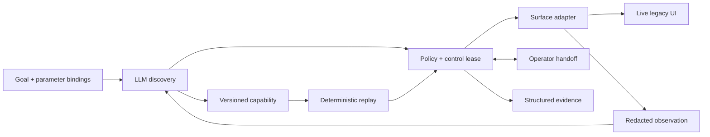

# Architecture

The implemented slice prepares a savings sub-account and stops at review in a local synthetic legacy core. One Node/TypeScript worker owns a Playwright browser context; a React control room uses the supplied DaOS Automation Panel Framework. Its `/api/automation/snapshot`, run, pause and stop adapters now report and control actual work. A separate operator page is a thin control proxy into that same context. No business API is called.

The model selects one visible control at a time; it receives a projected observation, parameter definitions, prior decisions and collected output names. It never receives input values or balances. The executor owns parameter binding, policy, reads and checkpoint verification. Discovery has step, wall-time and repeated-decision limits. The committed run uses authenticated Codex noninteractive requests with JSON Schema output and ephemeral sessions; an OpenAI Responses adapter is also provided. These are documented provider mechanisms ([Codex](https://learn.chatgpt.com/docs/non-interactive-mode), [structured outputs](https://developers.openai.com/api/docs/guides/structured-outputs)). Replay has no model dependency injected into its execution path; tests inject a provider that throws if called.

One worker and in-memory sessions make ownership easy to reason about. On-disk evidence survives completion; process restart does not resume a browser. This deliberately spends complexity on control and contracts, not queues.

# Artifact schema

`schema/capability.schema.json` is generated from strict Zod types. Schema version and capability version are distinct. A capability has a vendor/profile digest, typed inputs and outputs, target descriptions, ordered actions, per-step pre/post screen markers, bounded timeouts, an explicit exception taxonomy and a final checkpoint. The final checkpoint also compares member and nickname cells with invocation inputs; merely reaching a review page is insufficient. Decimal currency is a string, avoiding floating-point money errors.

Fill actions reference an input name, and read actions reference an output name. No values, credentials, arbitrary JavaScript, model transcript or executable selector strings are recorded. Provenance links model request receipts and observation hashes to the discovery run. The artifact is human-reviewable, but provenance alone is not approval or authenticity.

The trusted vendor profile supplies static control vocabulary, locator descriptions, safe action grants and business semantics. **Discovery learns the order, not the entire application vocabulary.** This is a deliberate seam: this slice implements one capability contract, not a universal task compiler. A saved artifact copies the observed controls' target definitions and is validated against the runtime's independent profile and policy. Editing an artifact cannot authorize a new control, weaken the success predicate or relabel submission as safe.

# Determinism & error handling

The surface uses exact accessible button names, named frame paths and an exact table label followed by its adjacent cell for unlabeled fields. There are no test IDs, positional `nth()` guesses or fuzzy fallbacks. Every target must resolve to exactly one visible control. Ambiguity and changed labels stop execution. The model does not choose recovery paths during replay.

Before and after each action, the runtime checks vendor/screen markers and exception states. It rechecks immediately before acting. Known loading is a bounded wait; a maintenance interstitial is dismissed once. `not_found` and `validation` return business outcomes without escalation or subsequent clicks. Permission denial, session expiry, unexpected dialogs and app errors request intervention. Missing targets and expired waits produce hard failures with the original step and safe diagnostic context. An actionability trial occurs before a click; an action is never blindly retried after the click boundary. Unknown post-action failure remains a failure even if an operator inspects it: no exactly-once guarantee is invented.

Results distinguish status, code, outputs, expected/observed markers, session/run identity and recovery/handoff/model counts. Output shape and invocation identity are checked at completion. Tests exercise the real UI with different parameters and injected runtime errors. Timestamps and latency naturally vary; “deterministic” means fixed actions and declared branches, not identical event bytes.

# Heterogeneity & multi-tenant

The `Surface` seam separates observe/act/verify/close from flow interpretation. This build already handles an iframe and nonsemantic table form. A desktop adapter could map target descriptions to UI Automation/AX ancestry; a visual adapter would need anchor regions, reference image hashes, calibrated coordinates, confidence thresholds and pre/post screenshots. The current schema intentionally rejects unsupported target strategies. Adding one requires a schema revision, adapter implementation and compatibility tests rather than silently treating coordinates like selectors.

At scale, store an immutable vendor capability with a semantic contract, then bind an institution/app instance to a reviewed profile version. Permit narrow overrides for entry point, frame ancestry, branding vocabulary and control labels; never allow an override to widen policy or erase checkpoints. Pin capabilities to profile digests. Promote a new binding only after synthetic contract tests and canary runs, preserving old versions for rollback. Vendor markers and unique target cardinality provide basic fail-closed drift detection here. They do not prove whole-application compatibility; a production registry would maintain tested version ranges and route failures to binding review, not automatic rerecording against customer data.

# Escalation & handoff

Control has four states: `automation → unclaimed → human → automation`, with `closed` terminal. A promise gate serializes every UI action and ownership mutation. Ceding waits for in-flight work, increments a fencing epoch, records context and releases the action gate while waiting. Claiming produces an in-memory opaque token and a new epoch; stale or competing operators are rejected. A model answer received after an ownership change is discarded.

The operator page shows current safe controls, markers, expected state and the event trail. Its buttons invoke the original browser page through the fenced endpoint; no new app session is opened. Operators can type or click allowed controls, repair the synthetic expired session and signal return. Resume requires the current epoch/token, vendor marker, expected checkpoint and no hard error. Human actions log target/action references and resulting safe state, never typed values. The loop then continues from the suspended checkpoint. Manual discovery is not silently compiled into reusable steps; it requires rerecording before artifact emission.

The local UI is intentionally minimal. The demo script marks its operator as scripted; committed browser-operated evidence separately demonstrates the same path. Production work would add authenticated operators, queue routing, expiring distributed leases, encrypted session hosting and crash recovery. A lost operator in this slice times out conservatively; token recovery/reassignment is not implemented.

# Safety

The browser starts with an empty isolated context. Exact origin/path allowlists apply to navigation, frames and all requests; non-GET traffic, popups, downloads and WebSockets are blocked, and service workers are disabled. Actions are allowlisted per trusted control. Reads and reversible preparation are allowed; final account submission is blocked for both automation and the operator. The runtime never treats an LLM risk label or artifact as authority. Headed direct control is rejected so input cannot bypass the handoff audit seam.

The target contains only generated training records. No DaOS customer export is used. Evidence is a positive projection of known UI labels, markers and typed events: unknown prose, raw DOM, screenshots, credentials and input/financial values are not persisted. Rich failure evidence is a rendered, redacted DOM projection. Sensitive outputs go only to the invocation caller; disk results and the panel redact them. Model reason codes are closed vocabulary. Hash-chained JSONL detects accidental edits; it is not tamper-proof storage or cryptographic attestation of the provider.

This is not a general DLP system. Input data and live cookies still exist in process/browser memory; a caller can log its returned outputs. Natural-language goals must not contain secrets. The fixed profile and synthetic target are the privacy boundary for this submission. Real deployments require institution-specific data classification, approved model hosting/retention, operator access control and encrypted evidence storage. The loopback console has host/origin checks, but local user authentication is deliberately absent.

# Cuts

Implemented depth is the capability contract, explicit error branches and same-session handoff. Cut: native desktop execution, arbitrary-app discovery, generic OCR/vision targeting, production credentials, distributed scheduling, capability approval/catalog infrastructure and crash-safe replay. The DaOS framework's original generic components remain reusable; its mock runtime is replaced and unsupported scheduling is not offered in the main control room.

Next work would make operator identity and session hosting production-safe, add a reviewed artifact/binding registry, then implement a second vendor/version adapter to test reuse. For irreversible workflows, add business reconciliation and idempotency semantics at the application boundary before allowing retries or unattended execution. A broader feature list would provide less confidence than proving those boundaries.
